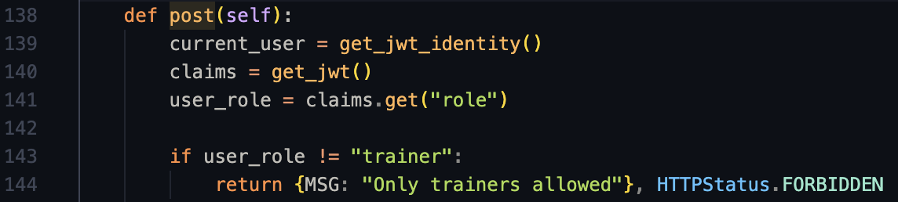
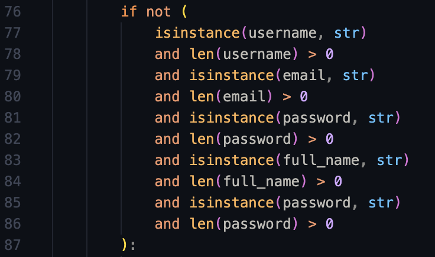
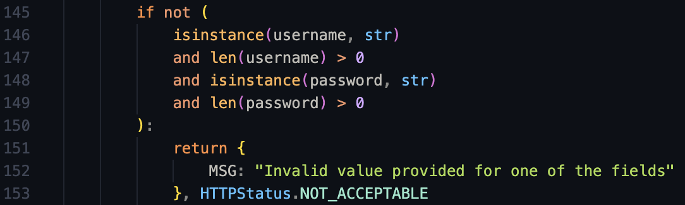
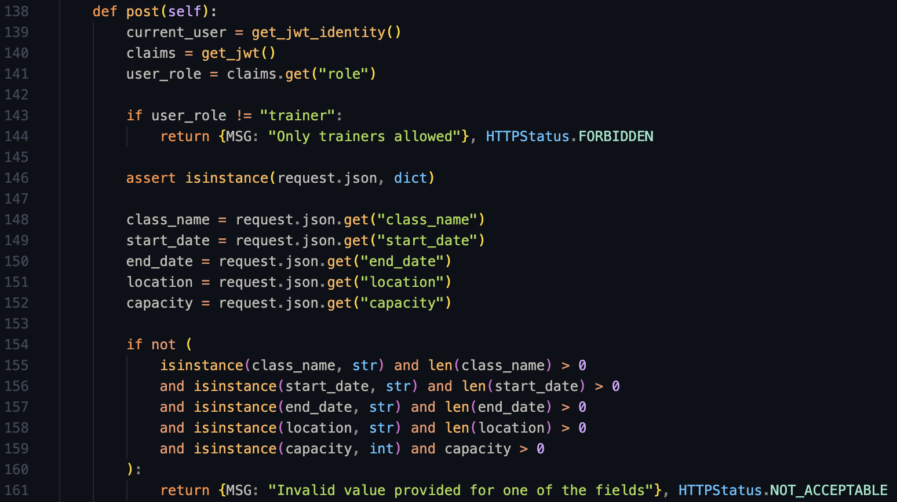

# Design Reflection - Sprint 3A

## Executive Summary

<!-- TODO: -->
<!-- A description of how you approached this deliverable in terms of tools used (if none, clearly state that), manual analysis done, and team member responsibilities -->

## Design Diagrams

<!-- TODO: -->
<!-- Include design diagrams once we finalize them -->

<!-- class diagram to show main classes and their associations -->

<!-- sequence diagram that captures the current flow for your book a class endpoint -->

<!-- sequence diagram that captures the current flow for your endpoint for sending reminders -->

## Analysis of the Reflection on Design Principles

### Identified SOLID Principle violations

**Principle:** Open/Closed Principle (OCP) Violation

**File:** `app/api/classes.py`

**Line Numbers:** 138-144

**Method Name:** CreateClass.post (and others like ClassBooking.post, ClassMembers.get)

**Explanation:** The code does not allow for easy extension because role-based permissions are hardcoded with string comparisons ("trainer", "member"). Adding new roles or changing permission logic requires modifying existing code rather than extending it through polymorphism or configuration.

**Refactoring:** We can replace the conditional logic with a Role Factory that maps user types to specific objects. Instead of each method performing string comparisons to determine permissions, it delegates the decision to a strategy object retrieved from the factory, which implements a unified interface (e.g., role.can_create_class()). This allows us to add a new role, such as an "Admin" which only requires creating a new class and registering it with the factory, leaving the core logic in classes.py unchanged.

---

<!-- add others here -->

<!-- Detailed written analysis of the reflection on design principles for Task 2. See task description for what should be provided for each violation -->

## Identified Code Smells

**Duplicate Code:** Identical validation logic for checking if string fields are non-empty.

**File and line number:** `app/apis/auth.py:76-87`

**Method Name**: `Register Endpoint`

**File and line number:** `app/apis/auth.py:145-153`

**Method Name**: `Login Endpoint`

**File and line number:** `app/apis/classes.py:139-161`

**Method Name**: `Create Class Endpoint`

---

## Reflection on Current Design for New Features

<!-- Task 4 reflection of how your current design (especially the identified violations) may help or hinder the implementation of the two new features above, especially while keeping maintainability and extensibility in mind -->
