# Design Reflection - Sprint 3A

## Executive Summary

<!-- TODO: -->
<!-- A description of how you approached this deliverable in terms of tools used (if none, clearly state that), manual analysis done, and team member responsibilities -->

## Design Diagrams

### Class Diagram

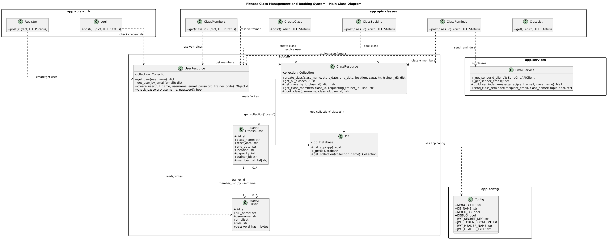

### Book Class Endpoint Sequence Diagram

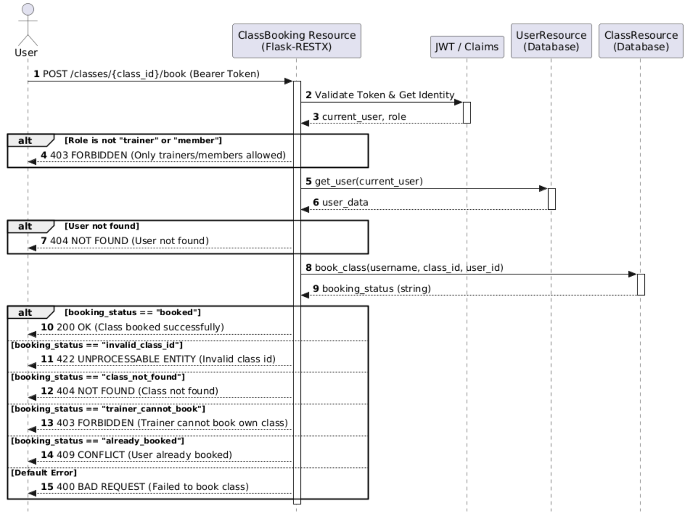

## Sending Reminder Endpoint Sequence Diagram

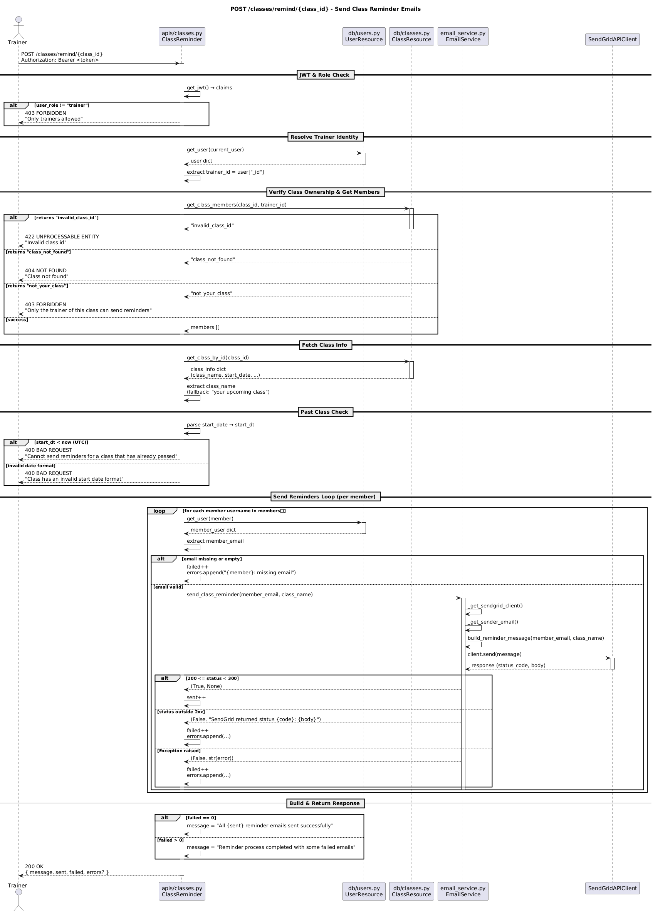

## Analysis of the Reflection on Design Principles

### Identified SOLID Principle violations

**Principle:** Open/Closed Principle (OCP) Violation

**File:** `app/api/classes.py`

**Line Numbers:** 138-144

**Method Name:** CreateClass.post (and others like ClassBooking.post, ClassMembers.get)

**Explanation:** The code does not allow for easy extension because role-based permissions are hardcoded with string comparisons ("trainer", "member"). Adding new roles or changing permission logic requires modifying existing code rather than extending it through polymorphism or configuration.

**Refactoring:** We can replace the conditional logic with a Role Factory that maps user types to specific objects. Instead of each method performing string comparisons to determine permissions, it delegates the decision to a strategy object retrieved from the factory, which implements a unified interface (e.g., role.can_create_class()). This allows us to add a new role, such as an "Admin" which only requires creating a new class and registering it with the factory, leaving the core logic in classes.py unchanged.

---

**Principle:** Single Responsibility Principle (SRP)

**File:** `app/api/classes.py`

**Lines:** 321-360

**Method Name:** ClassReminder.post

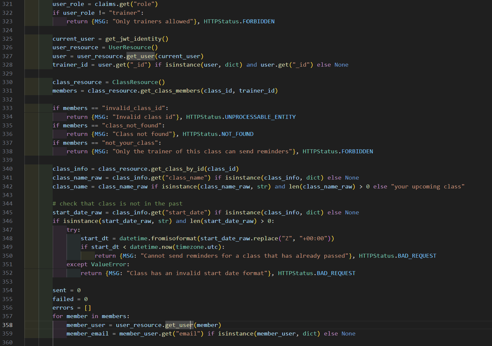

**Explanation:** The endpoint method handles auth checks, trainer ownership checks, class date validation, member lookup, email sending, error aggregation, and HTTP response shaping in one place. The method has multiple independent reasons to change: JWT/role policy changes, class-validation rules, email-delivery behavior, and response-contract changes. That concentration makes it harder to test and modify safely because unrelated concerns are coupled in a single function.

**Refactoring:** Extract a ReminderService with focused methods like validate_trainer_access, load_reminder_targets, validate_class_time_window, and send_reminders. Keep ClassReminder.post as a thin transport adapter that maps service results to HTTP codes.

---

**Principle:** Dependency Inversion Principle (DIP)

**File:** `app/apis/classes.py`

**Lines:** 176-181

**Class/Method:** CreateClass.post

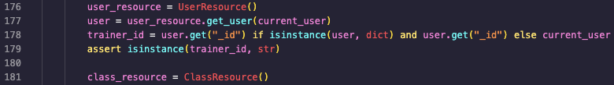

**Explanation:** CreateClass.post directly instantiates UserResource() and ClassResource() inside the method body. On lines 176 and 181, two database objects are created: user_resource, class_resource. It is hardcoded, there is no way to change this without editing the method. For example, if we wanted to swap out UserResource for a different implementation, or use a mock in tests, we cannot, the real MongoDB version is always created by this method.

**Refactoring:** Instead of creating new dependencies inside the method, they should be passed in from outside. The handler would just use whatever it receives, without knowing what the specific implementation is. This way the database layer can be altered and this method does not have to change.

---

**Principle:** Open/Closed Principle (OCP)

**File:** `app/apis/classes.py`

**Lines:** 236-250

**Class/Method:** ClassBooking.post

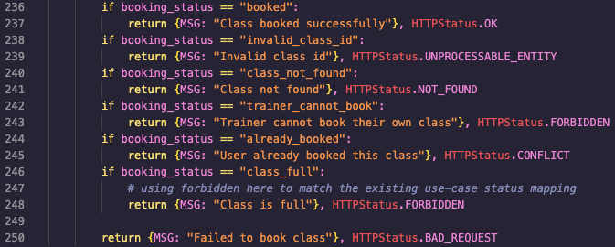

**Explanation:** Booking outcomes from ClassResource.book_class() are returned as plain strings such as "class_full" and "already_booked" using a series of "if" statements. If a new booking outcome is introduced such as "class_cancelled", the existing ClassBooking.post method must be opened and modified, violating OCP.

**Refactoring:** Replace string return codes with a BookingResult enumeration. Then map values to HTTP responses in a single dictionary. New outcomes are then handled by adding one member and one mapping entry, without making additions.

---

**Principle:** Open/Closed Principle (OCP)

**Status:** Violation

**File:** `app/db/classes.py`

**Lines:** 60-84

**Method:** ClassResource.book_class

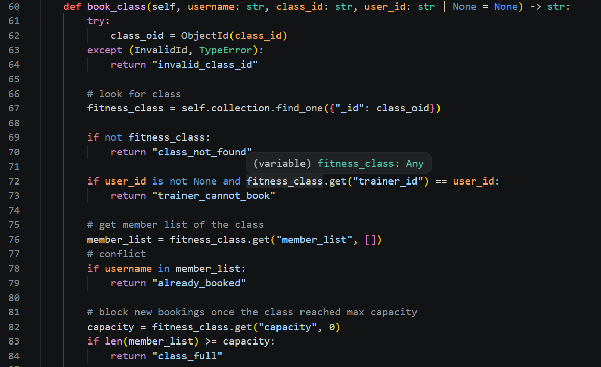

**Explanation:** Booking outcomes are returned as string literals such as "booked", "invalid_class_id", and "already_booked". This creates a stringly typed protocol that callers must hardcode with if-chains. Adding a new outcome requires modifying the code in multiple places and files, so behavior extension is not closed for modification.

**Refactoring:** Replace string literals with a typed result (possibly enum) or domain exceptions. Alternatively, figure out a different approach so new outcomes are added in one place, not across endpoints.

---

### Reflection on the Analysis

<!-- TODO: insert the reflection on our analysis paragraphs here -->

## Identified Code Smells

**Duplicate Code:** Identical validation logic for checking if string fields are non-empty.

**File and line number:** `app/apis/auth.py:76-87`

**Method Name**: `Register Endpoint`

**File and line number:** `app/apis/auth.py:145-153`

**Method Name**: `Login Endpoint`

**File and line number:** `app/apis/classes.py:139-161`

**Method Name**: `Create Class Endpoint`

---

**Comments:** Redundant comment that could be explained with just code.

**File and line number:** `app/apis/classes.py:244-278`

**Method Name**: `ClassMembers`

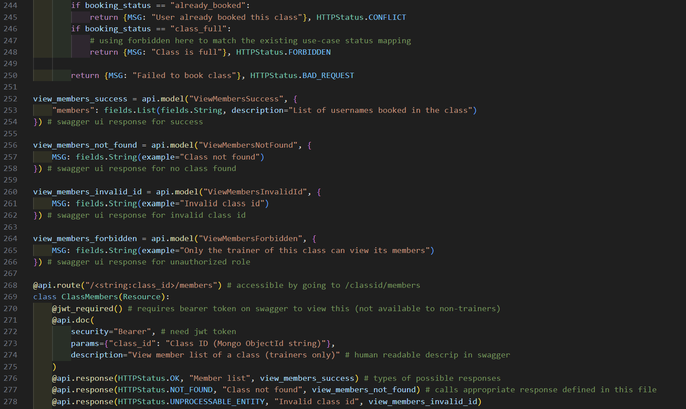

---

**Long Method:** One endpoint method handles authorization, ownership checks, class lookup, date validation, email iteration, error aggregation, and response construction in a single block.

**File and line number:** `app/apis/classes.py:319-381`

**Method Name**: `ClassReminder.post in ClassReminder`

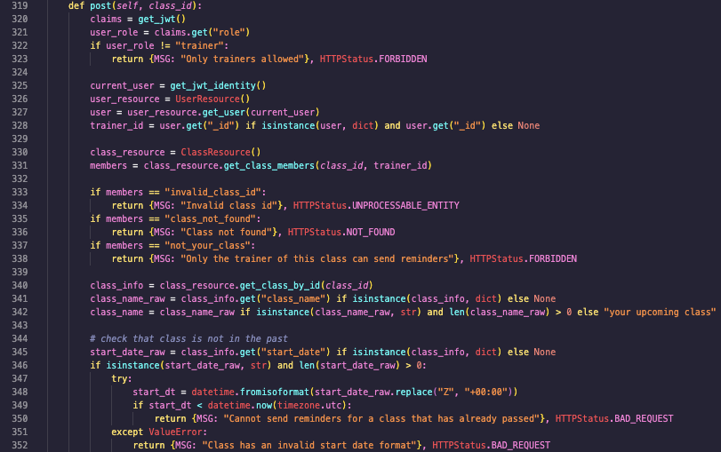
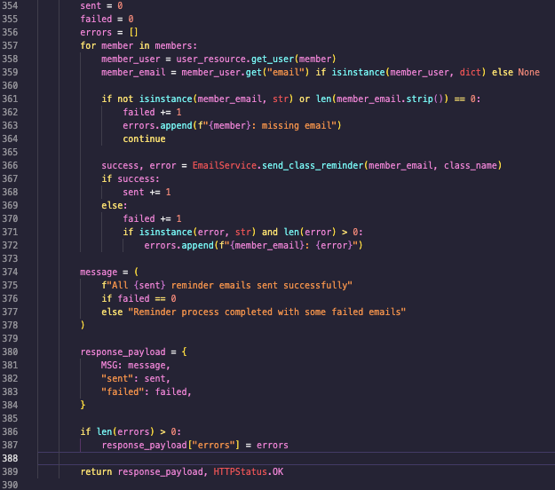

---

**Primitive Obsession:** Usage of primitive types instead of small objects for simple tasks.

**File and line number:** `app/apis/classes.py:32-40`

**Method Name**: `ClassResource.get_class_by_id`

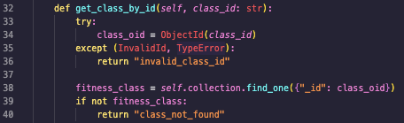

**File and line number:** `app/db/classes.py:44-58`

**Method Name**: `ClassResource.get_class_members`

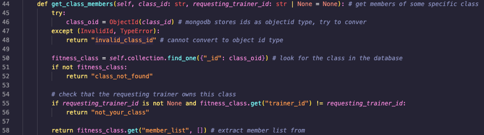

**File and line number:** `app/db/classes.py:60-94`

**Method Name**: `ClassResource.book_class`

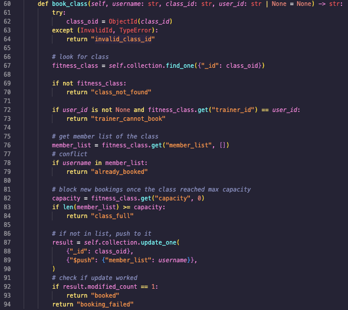

**File and line number:** `app/apis/classes.py:214-250`

**Method Name**: `ClassBooking.post`

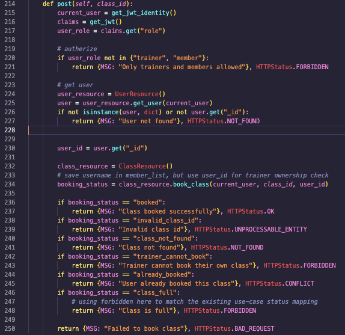

---

**Duplicate Code:** same three-line block

**File and line number:** `app/apis/classes.py:289-291`

**Method Name**: `ClassReminder.get`

**File and line number:** `app/apis/classes.py:326-328`

**Method Name**: `ClassReminder.post`

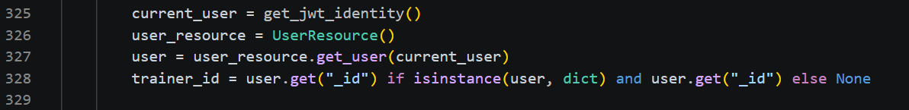

---

**Dead Code:** redundant validation - password field validated twice

**File and line number:** `app/apis/auth.py:76-87`

**Method Name**: `Register.post`

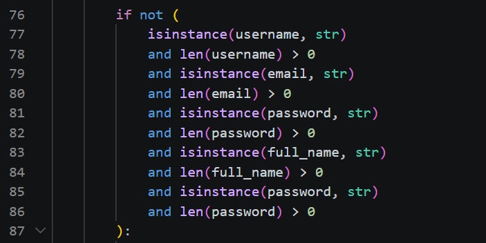

---

## Reflection on Current Design for New Features

<!-- TODO: Task 4 reflection of how your current design (especially the identified violations) may help or hinder the implementation of the two new features above, especially while keeping maintainability and extensibility in mind -->
