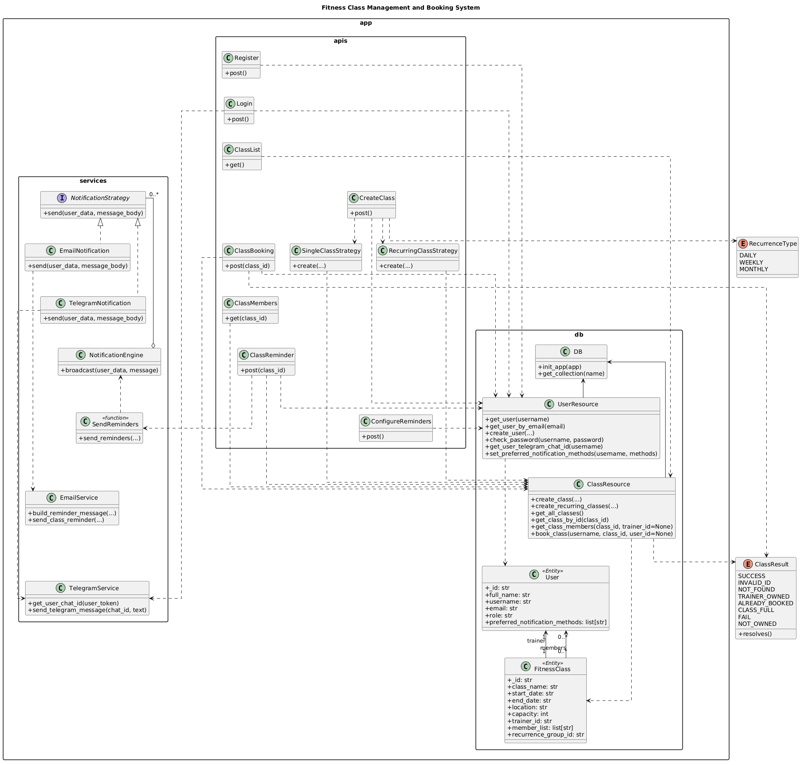

# Redesign Documentation - Sprint 3B

## Fixing Violated Design Principles and Code Smells

**Design Principle Violations and Fixes:**

- Open/Closed Principle (OCP) Violation CreateClass.post (and others like ClassBooking.post, ClassMembers.get)

  Fix: The hardcoded role checks in ClassBooking.post and ClassMembers.get were replaced with the @require_roles(TRAINER, MEMBER) decorator. Adding a new role now only requires changing the decorator argument, without modifying the method body.

- Single Responsibility Principle (SRP) ClassReminder.post

  Fix: Added helper functions to remove all logic from the actual endpoint, was also fixed through the new notification feature.

- Dependency Inversion Principle (DIP) CreateClass.post

  Fix: Fixed the DIP issue by moving the creation of UserResource and ClassResource out of the post() method and into the constructor. The endpoint now uses self.user_resource and self.class_resource, which can be passed in from outside or default to the real implementations. This makes the method less hardcoded, easier to test with mocks, and more flexible if the database/resource layer changes later.

- Open/Closed Principle (OCP) ClassBooking.post

  Fix: he ClassResource.post method along with other methods in the app were using string literals comparisons to validate the return values, in this case from the ClassResource.book_class method. This would make it difficult to add to subtract different outcomes. As such, we implemented a central enumeration class where all the different outcomes and return messages are resolved. Now, different methods will use the same class to validate return messages. 
  
- Open/Closed Principle (OCP) ClassResource.book\*class

  Fix: For ClassBooking, following the logic from the previous fix, instead of returning plain strings, it will reference the enumeration class and use them as return values. 

**Code Smells and Fixes:**

- Duplicate Code: Identical validation logic for checking if string fields are non-empty

  Fix: I fixed the duplicate code by moving the repeated string validation logic into a helper function, are_non_empty_strings(). This removed redundancy, made the endpoints cleaner, and ensures any future changes to validation only need to be made in one place.

- Long Method: One endpoint method handles authorization, ownership checks, class lookup, date validation, email iteration, error aggregation, and response construction in a single block

  Fix: _TODO: add ur fix explanation here_

- Primitive Obsession: Usage of primitive types instead of small objects for simple tasks
  Fix: Here a few methods, ClassResource.get_class_by_id, ClassResource.get_class_members, ClassResource.book_class, and ClassBooking.post were returning plain strings. All their return types are the same type of error messages which we have implemented to fix OCP violations. Instead of returning strings, these methods now return the enumeration class with the different error message types. 

- Duplicate Code: same three-line block

  Fix: The four-line block that fetches user and extracts their trainer ID was copy-pasted in both ClassMembers.get and ClassReminder.post. Extracted this code into helper function \_get_trainer_id() and replaced both duplicates with a call to it.

- Dead Code: redundant validation - password field validated twice

  Fix: In Register.post in auth.py, the password field was being validated twice in the same if condition. Deleted the redundant second check since it could not change the outcome.

## Design Patterns for new Features

> **Feature 6: Create Recurring Class**  
> As a trainer, I want to create recurring classes (e.g., daily or monthly) so that I don’t have to manually re-enter the same class multiple times.

**Design Pattern Used:** Strategy

**Explanation and Refactoring**

The CreateClass.post method needed to handle two distinct cases, one for single classes and one for recurring ones. Without the Strategy pattern, this would have meant a growing if/else block containing both algorithms, making it harder to extend (like adding another recurrence type) and test.

The refactor extracted each algorithm into its own class (SingleClassStrategy, RecurringClassStrategy) with a shared create interface. The post method now just selects the right strategy based on is_recurring Boolean variable, does notneed to know the details of either implementation. This keeps post clean while each strategy has its own creation logic.

> **Feature 7: Configure Notifications**  
> As someone registered in a class, I want to choose how I receive reminders (e.g., email and/or Telegram and/or SMS etc) so I can stay informed in the ways that suit me.

**Design Pattern Used:** Strategy

**Explanation and Refactoring**

For the new notification feature, we used the Strategy pattern to make reminder delivery flexible and to keep the endpoint from handling routing logic directly. The ClassReminder endpoint uses the send_reminders() function, which send the notifications through the new NotificationEngine. Each delivery method follows the same NotificationStrategy interface, with a single send() method. Right now, the system includes two concrete strategies EmailNotification and TelegramNotification. The engine first checks each member’s preferred_notification_methods field and only uses the methods that user has selected.

## New Class Diagram and It's Changes

**Explanation of Changes**

The main differences in the new class diagram is that we now have a much cleaner and organized separation of logic, as well as additional helper elements which we used for the refactor and new features. Some examples of these helper elements include the enums we used to simplify response and result logic, such as ClassResult. The most significant changes, however, are evident through the new design strategies we implemented for features 6 and 7. Key changes per feature are the following:

_Feature 6_

The updated diagram introduces a Strategy Pattern for class creation, where CreateClass routes to either SingleClassStrategy or RecurringClassStrategy based on the is_recurring boolean. The recurring strategy takes two additional parameters: recurrence_type (either DAILY, WEEKLY or MONTHLY) and recurrence_count, how many times the class should reoccur. ClassResource.create_recurring_classes() method generates each new class assigning a recurrence_group_id, as well as the timings for each class with respect to the recurrence interval chosen. Return types across both strategies are standardized through ClassResult Enum.

_Feature 7_

The new Configure Notifications feature updates the diagram by adding a new ConfigureReminders endpoint under app.apis.reminders. It handles POST requests to /reminders/configure and lets authenticated users update how they want to receive class reminders. Then the larger changes in the class diagram are visible through the new interface of the NotificationStrategy which handles the new logic for using different strategies to send notifications to members. The SendReminders function is used in the ClassReminder endpoint since it abstracts the logic notification service allows the endpoint to remain minimal, while allowing us to change the actual implementations without affecting other places.

## Member Responsibilities

To ensure everyone collaborates equally, similarly to Sprint 3A, we started by creating a composite Google Doc where we assigned responsibilies. For each task, we separated our responsibilities as such:

**Task 1**

- Each member contributed to fixing 1 or 2 design principle violations and 1 or 2 code smells
- For each new feature, we discussed together the appropriate design patterns and split up into two groups to work on the features. Dijar and Viestur were responsible for feature 6, Oleksandr and Tokla were responsible for feature 7.

**Task 2**

- With the groups established and violations + smells fixed, we worked together to implement each feature.

**Task 3**

- Adding tests were part of the individual features, Viesturs and Dijar added tests for feature 6, Oleksandr and Tokla added tests for feature 7.

**Task 4**

- CI pipeline works as before, does not need to be changed.

**Task 5**

- We collaborated on adding changes to the new class diagram, each member pointing out what is missing, what needs to be changes, etc.
- Then we added more specific explanation of changes based on feature implementation groups.
