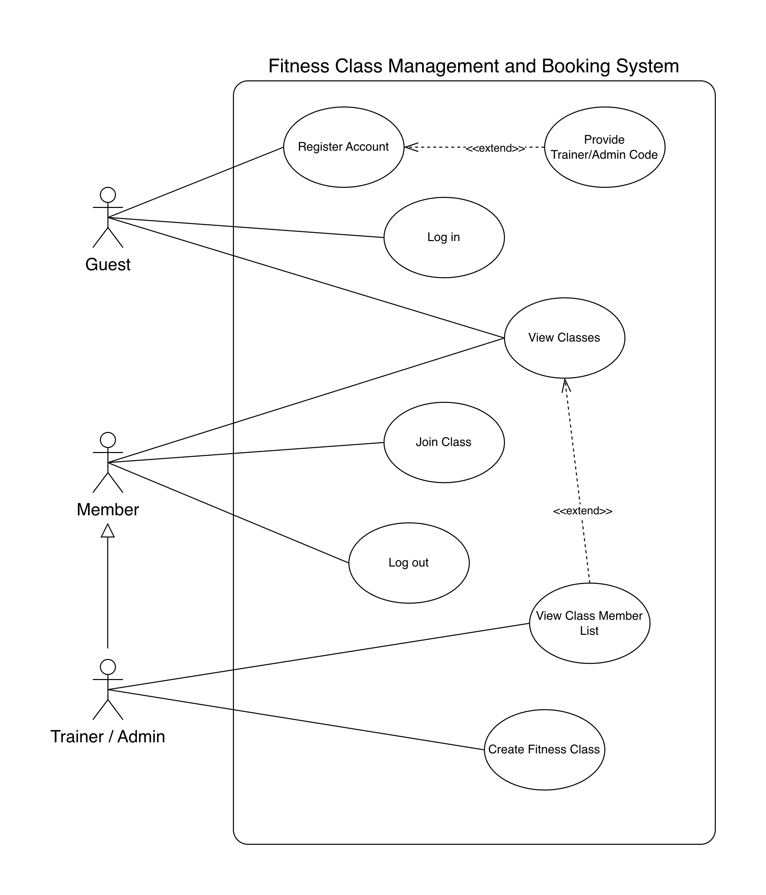

# Requirements Elicitation and Analysis

Date met with client: 10 February, 2026

## Elicitation Techniques Used

Before meeting the client, we met with our group to carefully review the details for Sprint 1.

The main elicitation technique used was a semi-structured interview. We had prepared questions to clarify each feature before meeting with the client.

1. Feature 1: Create Class
   1. Who is authorized to create a class?
   1. Do classes have fixed capacity?
   1. What is the information needed for the creation of each fitness class?
   1. Can two classes be in the same room at overlapping times?
   1. ⁠What happens when capacity is reached: block booking vs. allow waitlist?
   1. ⁠Can a class have multiple trainers?

1. View Class List (Public Page)
   1. Is there a difference between a member and guest?
   1. Should users be logged in to view the classes?
   1. ⁠Do we show capacity and “spots remaining” publicly, or only “available/full”?

1. Feature 3: Book a Class
   1. Should we prevent users from joining clashing classes? Is there a limit on how many classes a user can join?

1. Feature 4: View Member/Guest List of a Class
   1. Can class trainer or center admin remove people from classes / ban them from the system?
   1. Should users be authorized to view the classes?
   1. Can trainers only see member lists for classes they created, or any class?

We also asked general questions regarding the roles and the app in general:

- Can you clarify the roles we have?
- Should we have different registration options for a member and a trainer?
- Is a frontend required?
- Can classes be dropped?
- Can we restrict certain classes to different ages?

## Reflection on Techniques and Important Clarifications

### Selected Techniques Reflection

Overall, our primary semi-structured interview technique worked very well, providing us with all the details and insights needed to successfully implement and break down the 4 required features into their respective use cases. Since this was the first meeting with the client, it was important to get a general understanding of the implementation needed, and these elicitation techniques allowed us to ask our main guiding questions, follow-up questions, and so on together as a group. Since we have the foundational implementation complete, we might adjust our techniques to better reflect the needs of subsequent sprints. For example, if the next sprint will focus on more technical and complex additions or adjustments, we might provide concrete examples for implementation or use a comparative approach to clarify.

### (2) Important clarifications gained through the meeting

A feature we were initially unsure about was the extent of permissions or roles that trainers and admins can use within the system. To clarify this, we asked several targeted questions during our client meeting, such as:

- Can a trainer kick or ban a member from the system?
- Can a user see other users who booked a class, or is this information limited to the trainer?
- Can a trainer view members of every class, or only the classes they have created?
  These questions helped us better understand the responsibilities and limitations of each actor, which directly informed our backend implementation. For example, in our fitness class model, we included the trainer_id for each class. This ensures that when a trainer tries to view the members of a class, their ID must match the ID stored in the class, enforcing proper access control.

We also clarified the system would have three user types: admin, member, and guest. A guest can only view a list of available fitness classes but cannot book any classes. Members and trainers have additional permissions: members can book classes, while trainers can create classes and view the members of the classes they own. This distinction allowed us to define role-based access throughout our API and avoid unauthorized actions.

# Requirements Specification

## UML use case diagram for Sprint 1 Features



## Fleshed out use cases for all four features

### Feature 1: Create Class

---

**Use Case Name**: Create fitness class

**Preconditions**

- User is authenticated as `trainer`.

**Main Success Scenario**

1. User sends a create class request `POST /classes/create-class` with class details in JSON body.
1. System validates that role is `trainer`.
1. System validates input types/values (all fields present and valid, capacity > 0).
1. System creates a new class record in the database with `class_name, start_date, end_date, location, capacity, trainer_id,` and `member_list` initialized as an empty list.
1. System returns `201` Created with success message and the new `class_id`

**Alternative Flows / Extensions**

1. Role not allowed (not `trainer`)
   1. System returns `403` `Forbidden` with message `"Only trainers allowed"`.
2. Invalid field values / types
   1. System returns `406 Not Acceptable` with message `"Invalid value provided for one of the fields"`.
3. Create operation fails
   1. System returns `400 Bad Request` with message `"Failed to create class"`.

**Success Guarantee / Postconditions**

- A new class exists in the database.
- Class has a `unique_id` (returned as `class_id`).
- `trainer_id` is stored for ownership checks.
- `member_list` is initialized as [].

### Feature 2: View Class List

---

**Use Case Name**: View all available classes

**Preconditions**

- No authentication necessary

**Main Success Scenario**

1. User sends request to retrieve classes.
2. System fetches records from DB.
3. System returns 200 OK with list of class objects.

**Alternative Flows / Extensions**

1. No classes exist in database system returns 200 OK with empty list.

**Success Guarantee / Postconditions**

1. No data modified

### Feature 3: Book a Class

---

**Use Case Name**: Book Fitness Class

**Preconditions**

- User is authenticated (valid JWT token).
- User role is `member` or `trainer`.
- The target class exists.
- User is not already booked in the class.
- If user is a trainer, they are not the creator of that class.

**Main Success Scenario**

1. User sends a booking request for a class (`POST /classes/{class_id}/book`).
2. System validates authentication token.
3. System validates that role is allowed (`member` or `trainer`).
4. System validates class id format and confirms class exists.
5. System adds the user to the class member list.
6. System returns success message.

**Alternative Flows / Extensions**

1. Invalid class id format
   1. System returns `422 Unprocessable Entity` with message "Invalid class id".
2. Class not found
   1. System returns `404 Not Found`.
3. User already booked this class
   1. System returns `409 Conflict`.
4. Role not allowed
   1. System returns `403 Forbidden`.
5. Trainer attempts to book their own class
   1. System returns `403 Forbidden`.
6. Class is full.
   1. System returns `403 Forbidden`.
7. Unexpected booking failure
   1. System returns `400 Bad Request`.

**Success Guarantee / Postconditions**

- Username is stored in the class `member_list`.
- Booking is visible in later class/member-list queries.
- Duplicate booking is not created.

### Feature 4: View Member/Guest List of a class

---

**Use Case Name**: View Class Member List

**Preconditions**

- User role is `trainer`.
- The class ID is a valid.
- The target class exists.
- The requesting trainer is the owner of the class (`class.trainer_id` matches the `trainer_id`).

**Main Success Scenario**

1. User sends a request to retrieve the member list  
   (`GET /classes/{class_id}/members`).
2. System validates authentication token.
3. System validates that the user role is `trainer`.
4. System retrieves the trainer’s user record and extracts their `_id`.
5. System validates the `class_id` format (ObjectId conversion).
6. System retrieves the class from the database.
7. System verifies that the class belongs to the requesting `trainer`.
8. System returns `200 OK` with:
   ```json
   {
   	"members": ["username1", "username2", "..."]
   }
   ```

**Alternative Flows / Extensions**

1. Invalid class id format
   1. System returns `422 Unprocessable Entity` with message `"Invalid class id"`.
2. Class not found
   1. System returns `404 Not Found` with message `"Class not found"`.
3. Role not allowed
   1. System returns `403 Forbidden` with message `"Only trainers allowed"`.
4. Trainer does not own this class
   1. System returns `403 Forbidden` with message `"Only the trainer of this class can view its members"`.

**Success Guarantee / Postconditions**

- The trainer receives `200 OK` with the current member list.
- The returned `members` list accurately reflects the stored `member_list` in the database.
- The list may be empty if no users have booked the class.
- Only the trainer who owns the class can successfully retrieve the member list.

### Feature 5: Send Reminder Emails to Members Signed Up for a Class

---

**Use Case Name**: Send reminder emails for a class

**Preconditions**

- User role is `trainer`.
- The target `class_id` is valid.
- The requesting trainer is the owner of the class (`class.trainer_id` matches the requesting trainer’s `_id`).

**Main Success Scenario**

1. Trainer sends a reminder request  
   (`POST /remind/{class_id}`).
2. System validates authentication token.
3. System validates that the user role is `trainer`.
4. System validates the `class_id` format.
5. System retrieves the class from the database.
6. System verifies that the class belongs to the requesting trainer.
7. System retrieves the `member_list` for the class.
8. System retrieves the email addresses of all booked members in that class.
9. System generates a reminder email containing the class details, such as class name, start date, end date, and location.
10. System sends the reminder email to all members in the class using email service.
11. System returns `200 OK` with a success message confirming that reminders were sent.

**Alternative Flows / Extensions**

1. Invalid class id format
   1. System returns `422 Unprocessable Entity` with message `"Invalid class id"`.

2. Class not found
   1. System returns `404 Not Found` with message `"Class not found"`.

3. Role not allowed
   1. System returns `403 Forbidden` with message `"Only trainers allowed"`.

4. Trainer does not own this class
   1. System returns `403 Forbidden` with message `"Only the trainer of this class can send reminders for it"`.

5. No members are booked in the class
   1. System returns `200 OK` with message such as `"No reminder emails sent because no members are booked in this class"`.

6. Class has already started/passed
   1. System returns `400 Bad Request` with message `"Cannot send reminders for a class that has already passed"`.

7. Email service fails while sending
   1. System returns `400 Bad Request` with message `"Failed to send reminder emails"`.

**Success Guarantee / Postconditions**

- Reminder emails are sent to all valid email addresses of members booked in the selected class.
- No class data or booking data is modified by this operation.
- Only the trainer who owns the class can successfully trigger reminder emails.
- The system returns a result indicating whether the reminder operation succeeded, partially succeeded, or failed.

### Extra Features: Authentication and Registering Account

---

**Use Case Name**: Register Account

**Preconditions**

- User is a guest user who is not authenticated and has not yet made an account.

**Main Success Scenario**

1. User sends registration request (`POST /auth/register`) with `username`, `password`, and `full_name` in JSON body.
2. System validates that all required fields are strings and non-empty.
3. System checks that the username does not already exist in the database.
4. System creates a new user account with the hashed password.
5. System assigns the default role of `member` to the new user.
6. System returns `201 Created` with success message `"User registered successfully"`.

**Alternative Flows / Extensions**

1. Missing or invalid field values.
   1. System returns `406 Not Acceptable` with message `"Invalid value provided for one of the fields"`.
2. Username already exists.
   1. System returns `400 Bad Request` with message `"Username already exists"`.
3. If user provides a valid `trainer_code`, the account role is set to `trainer` instead of the default `member`.
4. Registration operation fails.
   1. System returns `400 Bad Request` with message `"Registration failed"`.

**Success Guarantee / Postconditions**

- A new user account exists in the database with a unique username.
- The password is securely stored as a hashed value.
- The user is assigned the appropriate role (`member` or `trainer`).
- The user can log in using their username and password.

<!-- ------- -->

**Use Case Name**: User logs in

**Preconditions**

- User has previously registered an account.

**Main Success Scenario**

1. User sends login request with username and password in JSON body.
2. System validates that both fields are strings and non-empty.
3. System validates password against hash for the respective username.
4. System generates JWT access token valid for user role.
5. System returns 200 OK and access token.

**Alternative Flows / Extensions**

1. Missing or empty fields.
   1. System notifies with message about invalid value provided with 406 Not Acceptable.
2. Incorrect username or password.
   1. System return message about incorrect credentials with 401 Unauthorized.

**Success Guarantee / Postconditions**

- User has access to features of his account type after logging in.
